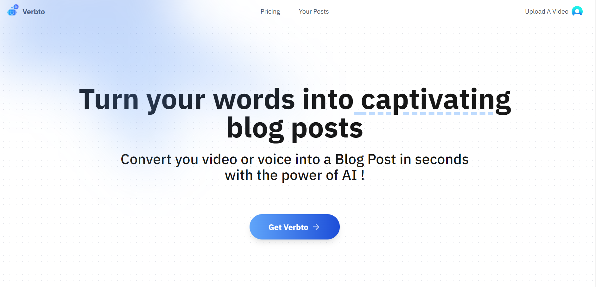
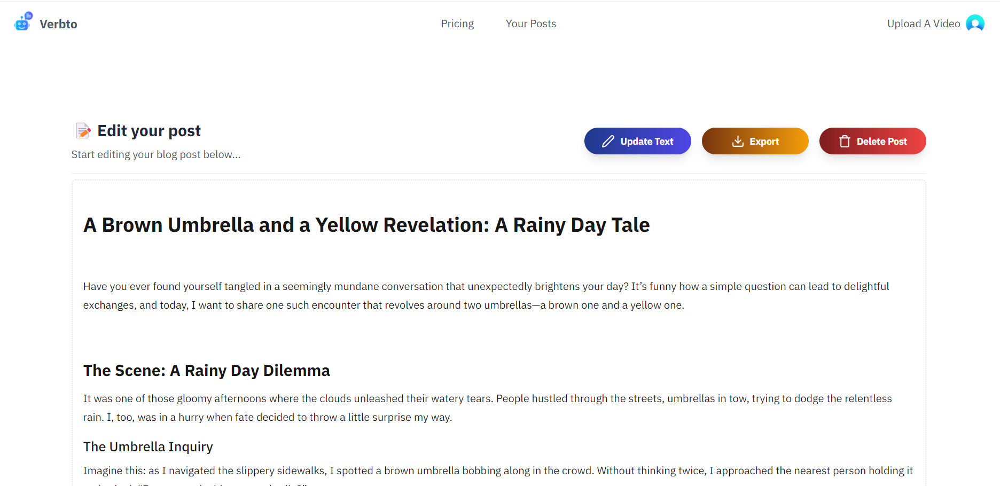

# Verbto - AI-Powered Audio and Video Transcription

Verbto is a powerful web application that transforms audio and video files into well-structured, text-based content using the Whisper AI model. With integrated user authentication, payment processing, and a scalable database, Verbto offers a seamless experience for converting spoken words into written text.

## Features

- **AI-Powered Transcription**: Utilizes Whisper AI to convert audio and video files into text.
- **User Authentication**: Secure login and registration with Clerk.
- **Payment Integration**: Flexible and reliable payment options via Stripe.
- **Scalable Database**: Uses NeonDB to store user data, transcriptions, and other essential information.
- **Modern UI**: Clean and intuitive user interface for a smooth user experience.

## Technologies Used

- **Whisper AI**: State-of-the-art AI model for audio and video transcription.
- **Clerk**: Handles all user authentication and secure sign-in processes.
- **Stripe**: Manages payment processing and subscriptions for premium features.
- **NeonDB**: Provides a fast and scalable database for storing user information and transcriptions.
- **React**: Frontend library for creating interactive user interfaces.
- **Next.js**: Framework for building the server-side logic and optimizing performance.
- **Tailwind CSS**: Utility-first CSS framework for styling the application.

## Project Overview

Verbto is designed to make transcription easy and efficient by combining advanced AI technology with user-friendly tools. Whether you're a content creator, journalist, or researcher, Verbto helps you quickly convert your audio and video content into readable and editable text.

### How it Works

1. **Upload a File**: Users can upload audio or video files in various formats.
2. **AI Transcription**: Whisper AI processes the file and generates a text-based transcription.
3. **Review & Edit**: Users can review, edit, and format the transcription directly within the app.
4. **Save & Manage**: Transcriptions are stored securely in NeonDB, accessible anytime through your account.

## Key Features

- **Seamless User Authentication**: Powered by Clerk, offering secure sign-in and registration.
- **Flexible Payment Options**: Powered by Stripe, ensuring secure and fast transactions.
- **Real-Time Transcription**: Whisper AI provides quick and accurate text conversion from audio and video files.
- **Data Storage**: Uses NeonDB for robust and efficient data management.
- **Responsive Design**: Optimized for all devices, including desktops, tablets, and mobile phones.

## Screenshots

*Upload audio or video files effortlessly.*

*Review and edit AI-generated transcriptions.*

## Future Enhancements

- **Support for Multiple Languages**: Expanding Whisper AI's capabilities to include more languages.
- **Advanced Editing Tools**: Enrich transcriptions with text formatting options.
- **Collaboration Features**: Allow teams to work on transcriptions together in real-time.
- **Custom User Profiles**: Enable personalized settings and preferences for individual users.

## License

This project is licensed under the MIT License - see the [LICENSE.md](LICENSE.md) file for details.

## Contact

For questions or support, feel free to reach out to us at **contact@verbto.com** or open an issue on GitHub.

